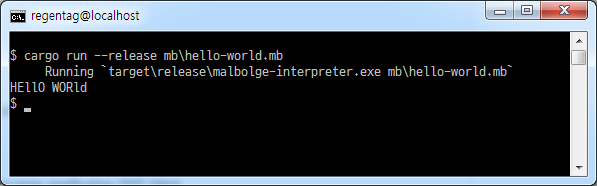

Malbolge 언어 인터프리터의 러스트 구현.

* Malbolge Language? http://esolangs.org/wiki/Malbolge
* Ben Olmstead의 원본(C언어) : http://www.lscheffer.com/malbolge_interp.html
* 테스트를 위한 Malbolge 소스 코드
 - Hello World : http://acooke.org/malbolge.html
 - 99 Bottles of Beer : http://www.99-bottles-of-beer.net/language-malbolge-995.html

